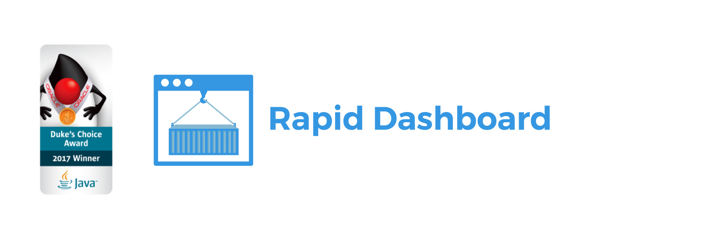
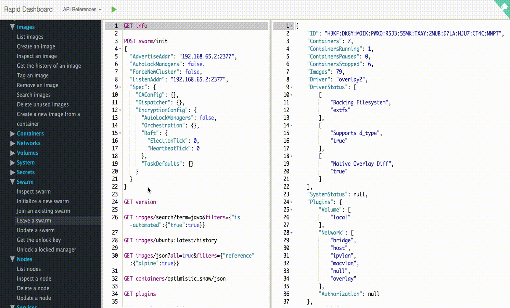

:experimental:

++++

    
    
    
    
    

++++

Rapid Docker Interface provides a connection between Docker queries and your Docker Host. Rapid changes the way of using Docker Engine API with ease. The Command Editor is your new Docker client communicating with the Engine. You can easily request supported Docker queries of https://docs.docker.com/engine/reference/api/docker_remote_api/[Docker Remote API]. Rapid Dashboard was distinguished as a Duke's Choice Award 2017 Winner in October at JavaOne. The award is one of nine awards issued for the innovative application of Java in 2017.

== Installation

Supported tags:

*  `_1.32_`, `_latest_` https://github.com/ozlerhakan/rapid/blob/master/Dockerfile[_(1.32/Dockerfile)_]
*  `_1.32-armhf_` https://github.com/ozlerhakan/rapid/blob/master/Dockerfile.arm[_(1.32/Dockerfile.arm)_]

The command below will pull the latest image of Rapid into your local docker host and start a container as daemon listening internally on port 8080 and we need to give access to the host’s Docker daemon by mapping to the Docker socket:

  $ docker run -d --name rapid  \
    -v /var/run/docker.sock:/var/run/docker.sock \
    -p 8080:8080 \
    ozlerhakan/rapid

If your docker host runs via docker machine, go into it using `$docker-machine ssh` and run the command.

then open your browser to `http://localhost:8080` or `http://<docker-host-vm-ip>:8080`, have fun!

In Docker Swarm World, you can run the rapid as a service like below:

  $ docker service create --name rapid \
    --mount="type=bind,source=/var/run/docker.sock,target=/var/run/docker.sock" \
    --constraint "node.role == manager" \
    -p 8080:8080 \
    ozlerhakan/rapid

== Demo

image:https://cdn.rawgit.com/play-with-docker/stacks/cff22438/assets/images/button.png["Try in PWD",link="http://play-with-docker.com?stack=/ozlerhakan/rapid/latest"]

== Notes

. Header Parameters (X-Registry-Auth) are not supported.
. Tags ending with `arm` should work on supported versions of the Raspberry Pi models.

== Versions

|===
|Docker Version |API & Tag Version  |Changes

|17.07.x
|1.31, latest
|https://docs.docker.com/engine/api/version-history/#v1-31-api-changes[API changes]

|17.06.x
|1.30, latest
|https://docs.docker.com/engine/api/version-history/#v1-30-api-changes[API changes]

|17.05.x
|1.29
|https://docs.docker.com/engine/api/version-history/#v1-29-api-changes[API changes]

|17.03.1
|1.27
|https://docs.docker.com/engine/api/version-history/#v127-api-changes[API changes]

|===

== Editor Shortcuts

Rapid contains the following shortcuts. Any other shortcut suggestions are always welcome.

[width="100%",options="header"]
|===
|Windows | Mac |Detail
|kbd:[Ctrl+D] |kbd:[&#8984;+D]| Duplicate line
|kbd:[Ctrl+Shift+C] |kbd:[&#8984;+&#8679;+C]| Copy the selection as cURL
|kbd:[Ctrl+X]|kbd:[&#8984;+X] | Remove current line
|kbd:[Shift+Enter]|kbd:[&#8679;+&#9166;] | Start new line
|kbd:[Alt+Shift+Up]|kbd:[&#8997;+&#8679;+Up] | Move line up
|kbd:[Alt+Shift+Down] |kbd:[&#8997;+&#8679;+Down] | Move line down
|kbd:[Ctrl+Mouse_Scroll_Up] |kbd:[&#8963;+Mouse_Scroll_Up] | Zoom in
|kbd:[Ctrl+Mouse_Scroll_Down] |kbd:[&#8963;+Mouse_Scroll_Down] | Zoom out
|kbd:[Ctrl+Alt+H] |kbd:[&#8984;+&#8997;+H] | Show shortcuts
|kbd:[Ctrl+Shift+R] |kbd:[&#8984;+&#8679;+R] | Clear editor
|kbd:[Ctrl+/] |kbd:[&#8984;+/] | Comment/Uncomment with line comment
|===

=== cURL Details

The following cURL commands are all valid so as to paste them into the command editor. When you paste a valid command, Rapid converts it to a corresponding valid Docker remote query.

[source, curl]
----
curl --unix-socket /var/run/docker.sock \
 -H "Content-Type: application/json" \
 -X POST http:/v1.32/containers/create \
 -d '
 {"Image": "alpine", "Cmd": ["echo", "hello world"]}
 '

curl --unix-socket /var/run/docker.sock -H "Content-Type: application/json" \
  -X POST http:/v1.32/containers/create \
  -d '{"Image": "alpine", "Cmd": ["echo", "hello world"]}'

curl --unix-socket /var/run/docker.sock \
 -H "Content-Type: application/json" \
 -X POST http:/v1.32/containers/create \
 -d '{"Image": "alpine", "Cmd": ["echo", "hello world"]}'

curl --unix-socket /var/run/docker.sock -X GET http:/v1.32/containers/json

curl --unix-socket /var/run/docker.sock -X GET http:/v1.32/images/json

curl --unix-socket /var/run/docker.sock -XGET http:/v1.32/containers/json

curl --unix-socket /var/run/docker.sock -XGET "http:/v1.32/containers/1c6594faf5/logs?stdout=1"

curl --unix-socket /var/run/docker.sock  -H "Content-Type: application/json"  -X POST http:/v1.32/containers/create -d'
 {"Image": "alpine", "Cmd": ["echo", "hello world"]}
 '

curl --unix-socket /var/run/docker.sock  -H "Content-Type: application/json"  -XPOST http:/v1.32/containers/create -d' {"Image": "alpine", "Cmd": ["echo", "hello world"]}'

curl --unix-socket /var/run/docker.sock\
  -X POST "http:/v1.32/commit?container=0888269a9d&repo=helloworld"
----

The kbd:[&#8984;+&#8679;+C] shortcut enables you to convert the selection to the equivalent cURL command and copy it to clipboard.

.a selected query from the command editor
----
POST containers/create?name=mycontainer
{
    "Image": "alpine",
    "Cmd": [
        "echo",
        "hello world"
    ]
}
----

.the equivalent cURL command of the query above
----
curl --unix-socket /var/run/docker.sock -XPOST "http:/v1.32/containers/create?name=mycontainer" -H "Content-Type: application/json" -d'
{
    "Image": "alpine",
    "Cmd": [
        "echo",
        "hello world"
    ]
}'
----

== Contributing

Any comments/issues/PRs are always welcome!

== License

Rapid is released under MIT.
