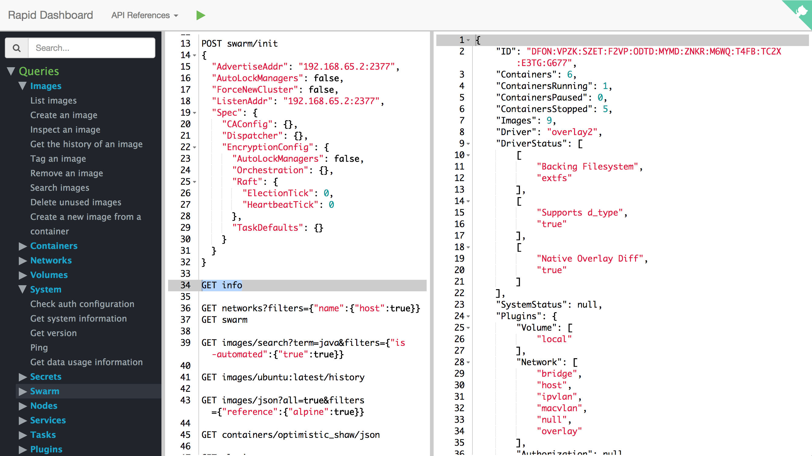

= A Rapid UI

This is a POC UI project that provides a connection between your Docker queries and your Docker Host. You can easily request basic Docker queries provided by https://docs.docker.com/engine/reference/api/docker_remote_api_v1.22/[Docker Remote API], on the Rapid Dashboard.  Since it is built based on the REST queries and you may look for a more functional UI, there is one which I _recommend_, called  https://github.com/crosbymichael/dockerui[Docker UI] that can satisfy your needs. On the other hand, you're always welcome to add more specs into this project.

=== How it works

You have probably good feelings about this project, plus you want to try it out. 

1. So, just run the mentioned command that will pull this project's image into your docker host and start a container, that is:
+
  $ docker run -d --name rapid  -v /var/run/docker.sock:/var/run/docker.sock -p 8080:8080 ozlerhakan/rapid
+ 
If your docker host runs via docker machine, go into it using `$docker-machine ssh` and run the command.
2. then open your browser to `http://<docker-host-ip>:8080`

3. and start requests! I just mentioned that you can request basic queries so what are they:

----
GET /containers/json
POST /containers/create
GET /containers/(id)/json
GET /containers/(id)/top
GET /containers/(id)/logs
GET /containers/(id)/changes
GET /containers/(id)/stats
POST /containers/(id)/start
POST /containers/(id)/stop
POST /containers/(id)/restart
POST /containers/(id)/kill
POST /containers/(id)/update
POST /containers/(id)/rename
POST /containers/(id)/pause
POST /containers/(id)/unpause
POST /containers/(id)/wait
DELETE /containers/(id)
GET /images/json
POST /images/create  (only: images/create?fromImage=<image-name-with-or-without-tag>)
GET /images/(name)/json
GET /images/(name)/history
POST /images/(name)/tag
DELETE /images/(name)
POST /auth
GET /info
GET /version
GET /_ping
GET /events
GET /volumes
POST /volumes/create
GET /volumes/<name>
DELETE /volumes/(name)
GET /networks
GET /networks/<network-id>
POST /networks/create
POST /networks/(id)/connect
POST /networks/(id)/disconnect
DELETE /networks/(id)
----

Just double-check the https://docs.docker.com/engine/reference/api/docker_remote_api_v1.22/[docker api site] because you need to interact with JSON documents If you use some of them. 

== License

Rapid is released under http://showalicense.com/?hide_explanations=false&year=2016&fullname=Kodcu.com#license-mit[MIT]. 
